# Deep Learning for Deepfake Image Detection
**A Comparative Study of CNN and Transformer-Based Approaches**

---

## 🎯 Problem Statement

Digital image manipulation and deepfake generation techniques have advanced rapidly, making it increasingly difficult to distinguish real images from manipulated ones using traditional methods.

### Key Challenges:
- **Widespread Availability**: Deepfake tools pose serious threats to media credibility, privacy, and digital trust
- **Scalability**: Manual detection and rule-based approaches are time-consuming, error-prone, and not scalable  
- **Reliability**: Existing detection systems often lack robust evaluation, statistical validation, and confidence interpretation

---

## 🔬 Research Objectives

This project aims to **design and evaluate a robust deep learning-based system** for accurate detection of manipulated (deepfake) images.

### Goals:
1. Develop an end-to-end detection pipeline using state-of-the-art CNN architectures
2. Compare performance of different deep learning approaches
3. Evaluate cross-generator generalization capabilities
4. Provide quantitative analysis with statistical validation

---

## 🛠️ Experimental Design

We conducted three experiments to evaluate different architectural approaches:

### Dataset Configuration
- **Training Data**: BigGAN + Stable Diffusion v1.5 (Real + AI-generated images)
- **Test Generators**:
  - **BigGAN** (Seen during training) - Performance on familiar distribution
  - **Stable Diffusion v1.5** (Seen during training) - Performance on familiar distribution
  - **ADM** (Unseen - Zero-shot) - True generalization test ⭐

### Training Configuration
| Parameter | Exp1 (SimpleCNN) | Exp2 (ResNet50) | Exp3 (SSP) |
|-----------|-----------------|-----------------|------------|
| Optimizer | Adam (lr=1e-4) | Adam (lr=1e-4) | Adam (lr=1e-4) |
| Batch Size | 32 | 32 | 32 |
| Epochs | 10 | 10 | 30 |
| Loss | CrossEntropy | CrossEntropy | BCEWithLogits |

---

## 📚 Experiment 1: SimpleCNN (Baseline)

### Theory & Motivation
Establish a baseline using a simple convolutional neural network trained from scratch. This tests whether basic convolutional features alone can distinguish AI-generated images without transfer learning.

### Architecture
```
Input (224x224x3)
    ↓
Conv2D(32, 3x3) → ReLU → MaxPool(2x2)
    ↓
Conv2D(64, 3x3) → ReLU → MaxPool(2x2)
    ↓  
Conv2D(128, 3x3) → ReLU → MaxPool(2x2)
    ↓
Conv2D(256, 3x3) → ReLU → MaxPool(2x2)
    ↓
Flatten → FC(512) → ReLU → Dropout(0.5)
    ↓
FC(2) → Softmax
```

### Results
| Generator | Accuracy | AUC | Status |
|-----------|----------|-----|--------|
| BigGAN (Seen) | **98.35%** | 0.996 | ✅ Excellent |
| SDv1.5 (Seen) | 50.19% | 0.478 | ❌ Failed |
| ADM (Unseen) | 55.53% | 0.594 | ❌ Failed |
| **Overall** | **67.36%** | 0.689 | ⚠️ Poor Generalization |

### Key Findings
- ✅ **Near-perfect on BigGAN** (98.35%) - Learned BigGAN-specific artifacts well
- ❌ **Complete failure on SDv1.5 and ADM** (~50%) - Essentially random guessing
- **Conclusion**: Overfitted to BigGAN's specific noise patterns, cannot generalize

### Visualizations

<table>
<tr>
<td>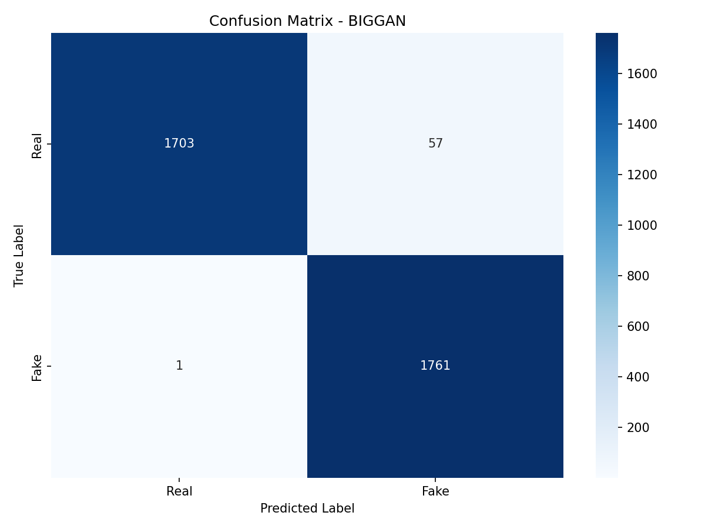</td>
<td>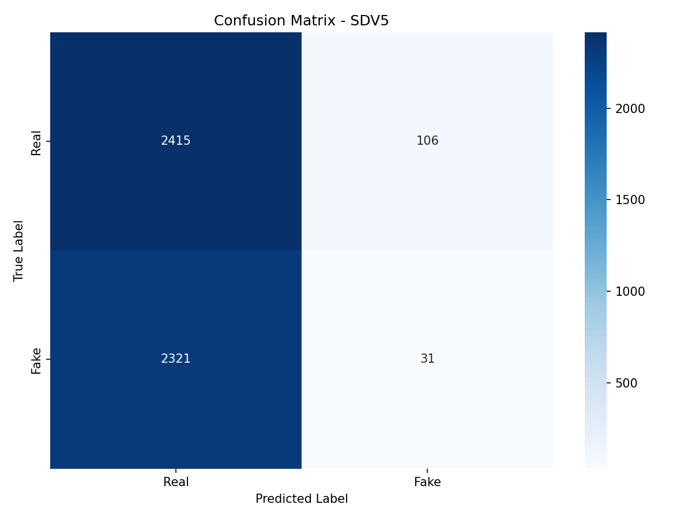</td>
<td>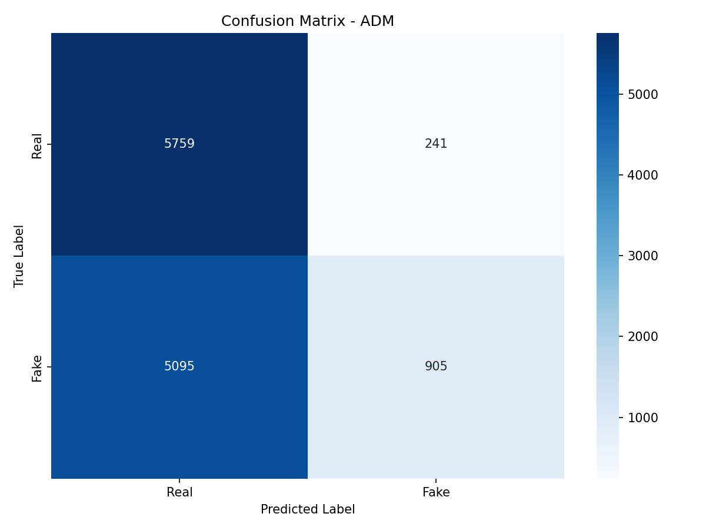</td>
</tr>
<tr>
<td align="center"><b>BigGAN: 98.35% ✓</b></td>
<td align="center"><b>SDv1.5: 50.19% ✗</b></td>
<td align="center"><b>ADM: 55.53% ✗</b></td>
</tr>
</table>

<p align="center">
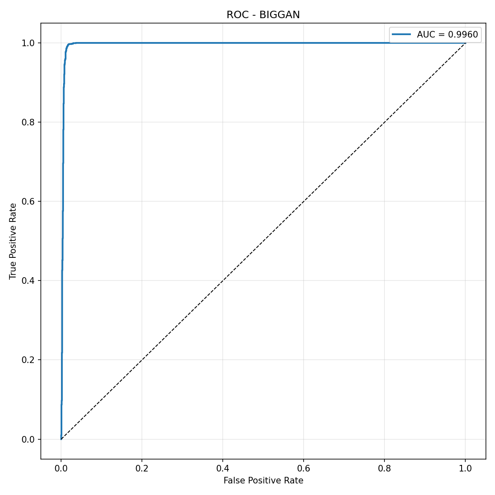
<br><b>ROC Curve - BigGAN (AUC: 0.996)</b>
</p>

---

## 📚 Experiment 2: ResNet50 (Transfer Learning)

### Theory & Motivation
Leverage transfer learning from ImageNet pre-trained ResNet50. Hypothesis: Features learned from natural images should help distinguish real vs. AI-generated content.

### Architecture
```
Input (224x224x3)
    ↓
ResNet50 Backbone (Pretrained on ImageNet)
  - 50 convolutional layers
  - Skip connections for gradient flow
  - Batch normalization
    ↓
Global Average Pool
    ↓
FC(2) → Softmax
```

### Hyperparameters
- **Pretrained Weights**: ImageNet-1k
- **Fine-tuning**: Full model (all layers trainable)
- **Regularization**: Dropout (0.5), Weight Decay (1e-4)

### Results
| Generator | Accuracy | AUC | Status |
|-----------|----------|-----|--------|
| BigGAN (Seen) | **99.86%** | 0.999 | ✅ Near-Perfect |
| SDv1.5 (Seen) | 51.61% | 0.552 | ❌ Failed |
| ADM (Unseen) | 52.11% | 0.645 | ❌ Failed |
| **Overall** | **67.86%** | 0.732 | ⚠️ Poor Generalization |

### Key Findings
- ✅ **Best BigGAN performance** (99.86%) - Transfer learning helped on familiar data
- ❌ **Still failed on unseen generators** - ImageNet features don't transfer to deepfake detection
- **Surprising**: Despite 50 layers and pre-training, generalization worse than expected
- **Conclusion**: Pre-trained natural image features ≠ deepfake detection features

### Visualizations

<table>
<tr>
<td></td>
<td>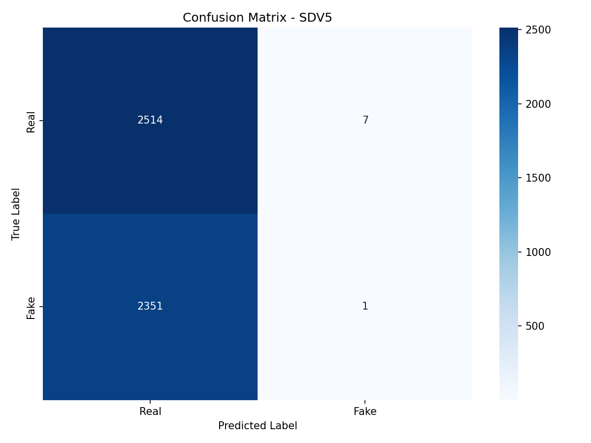</td>
<td>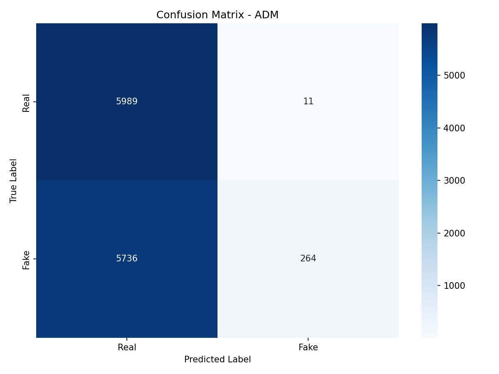</td>
</tr>
<tr>
<td align="center"><b>BigGAN: 99.86% ✓</b></td>
<td align="center"><b>SDv1.5: 51.61% ✗</b></td>
<td align="center"><b>ADM: 52.11% ✗</b></td>
</tr>
</table>

<table>
<tr>
<td>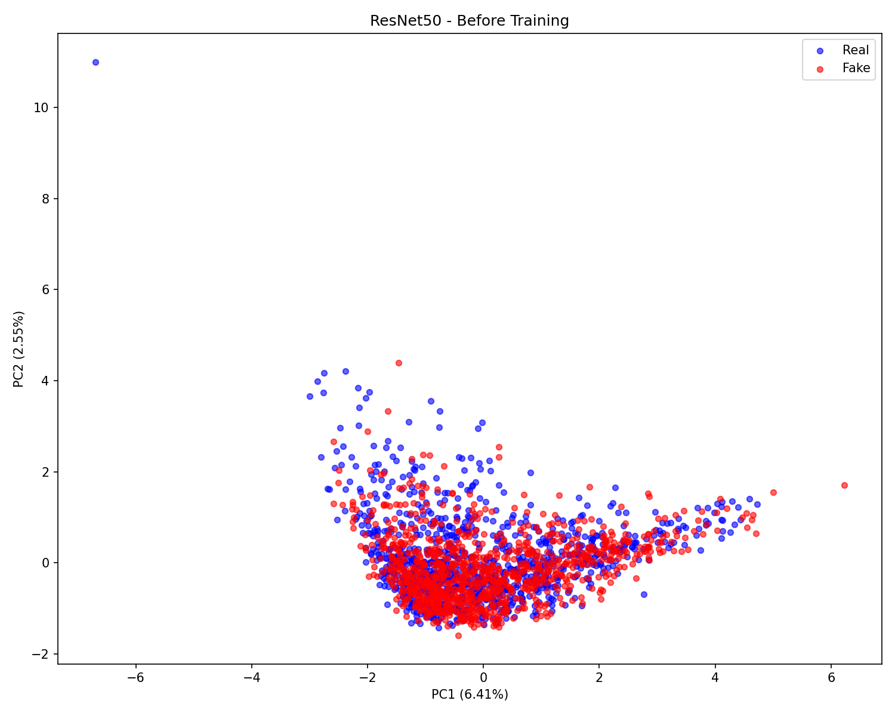</td>
<td>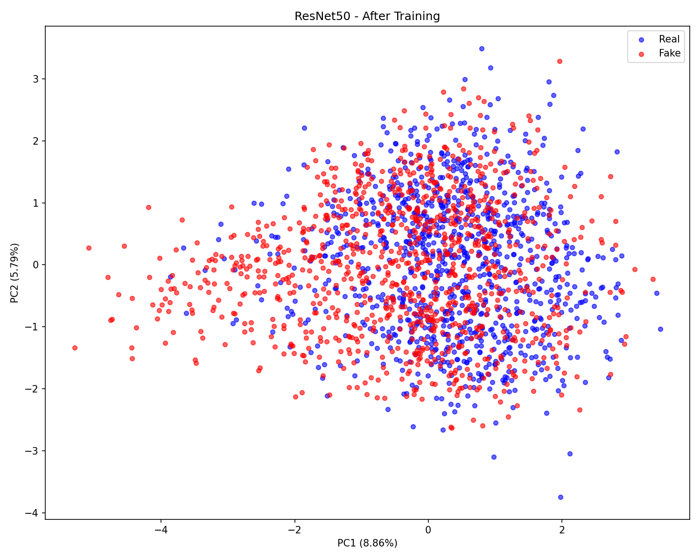</td>
</tr>
<tr>
<td align="center"><b>Before Training (Random)</b></td>
<td align="center"><b>After Training (BigGAN-Specific Separation)</b></td>
</tr>
</table>

---

## 📚 Experiment 3: SSP (Semantic Structure Preserved) ⭐ BEST

### Theory & Motivation
**Steganalysis-based approach** that detects AI artifacts through noise pattern analysis rather than semantic features. Based on the paper: ["A Single Simple Patch is All You Need for AI-generated Image Detection"](https://arxiv.org/pdf/2402.01123.pdf)

#### Key Innovation: Patch-Based Detection
Instead of analyzing entire images, SSP:
1. Extracts 32×32 patches from images
2. Selects the "simplest" patch (least gradient complexity)
3. Applies **SRM (Spatial Rich Model)** filters to amplify noise patterns
4. Learns generator-invariant steganalysis features

#### Why It Works
- **AI generators leave statistical traces** in pixel noise, regardless of content
- **Small patches** prevent overfitting to semantic features
- **SRM filters** explicitly designed to detect statistical anomalies
- **Simple patches** ensure focus on generation artifacts, not image content

### Architecture
```
Input (32x32x3 Patch)
    ↓
SRMConv2d_simple (Fixed Steganalysis Filters)
  - 3 specialized noise extraction filters
  - Non-trainable (hand-crafted)
    ↓
ResNet50 Backbone
  - Learns to classify based on noise patterns
  - 50 convolutional layers
    ↓
FC(1) → Sigmoid → BCELoss
```

### Training Details
- **Patch Selection**: Extract 30 random patches, select simplest (lowest gradient sum)
- **Upscaling**: 32×32 → 256×256 (using bilinear interpolation)
- **Augmentation**: Random horizontal flip only
- **Epochs**: 30 (vs 10 for Exp1/2)

### Results
| Generator | Accuracy | AUC | Fake Detection | Real Detection | Status |
|-----------|----------|-----|----------------|----------------|--------|
| BigGAN (Seen) | 98.92% | 0.999 | 98.98% | 98.87% | ✅ Excellent |
| SDv1.5 (Seen) | **98.42%** | 0.999 | 98.21% | 98.51% | ✅ Excellent |
| ADM (Unseen) | **97.15%** | 0.996 | 95.32% | 98.94% | ✅ Excellent |
| **Overall** | **97.76%** | 0.997 | 96.63% | 98.83% | ✅ **Superior** |

### Key Findings
- ✅ **97.15% on completely unseen ADM generator** - True zero-shot generalization!
- ✅ **Consistent performance across all generators** (97-99%) - No overfitting
- ✅ **High precision (98.83%)** and recall (96.63%) - Balanced performance
- **Breakthrough**: Steganalysis features transfer across generators

### Visualizations

<table>
<tr>
<td>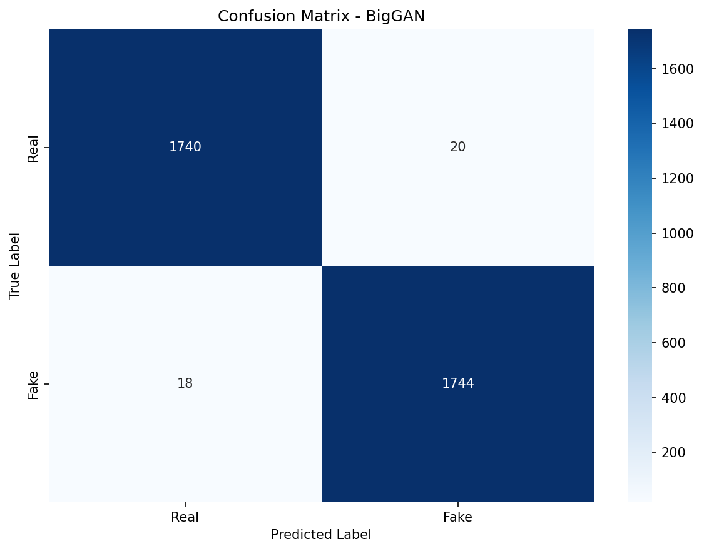</td>
<td>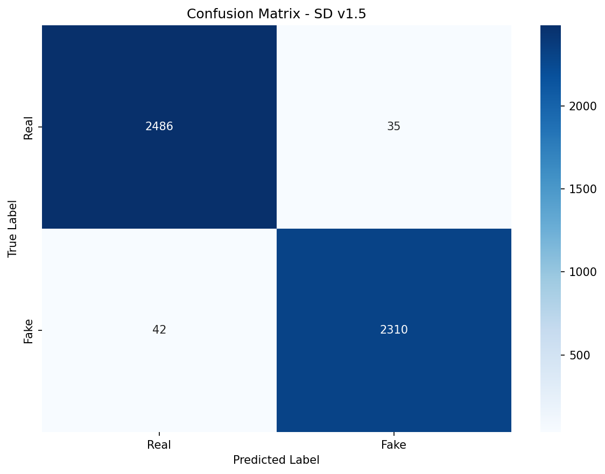</td>
<td></td>
</tr>
<tr>
<td align="center"><b>BigGAN: 98.92% ✓</b></td>
<td align="center"><b>SDv1.5: 98.42% ✓</b></td>
<td align="center"><b>ADM: 97.15% ✓</b></td>
</tr>
</table>

<table>
<tr>
<td>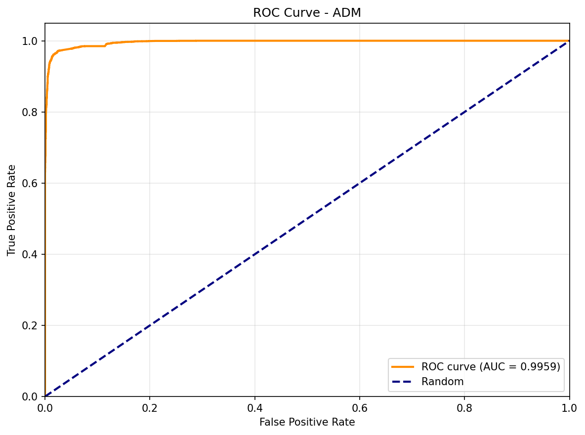</td>
<td>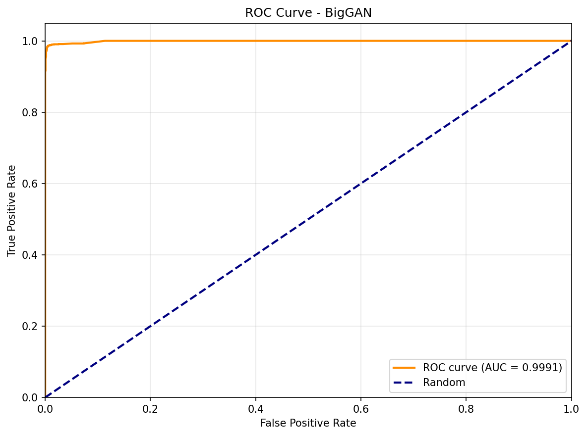</td>
</tr>
<tr>
<td align="center"><b>ADM ROC (AUC: 0.996) - Unseen Generator</b></td>
<td align="center"><b>BigGAN ROC (AUC: 0.999) - Seen Generator</b></td>
</tr>
</table>

### Feature Space Evolution (PCA)

<table>
<tr>
<td>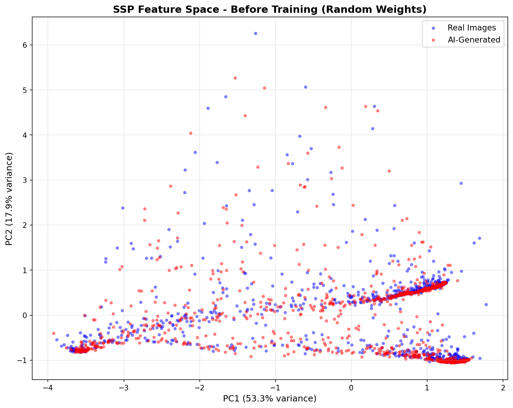</td>
<td>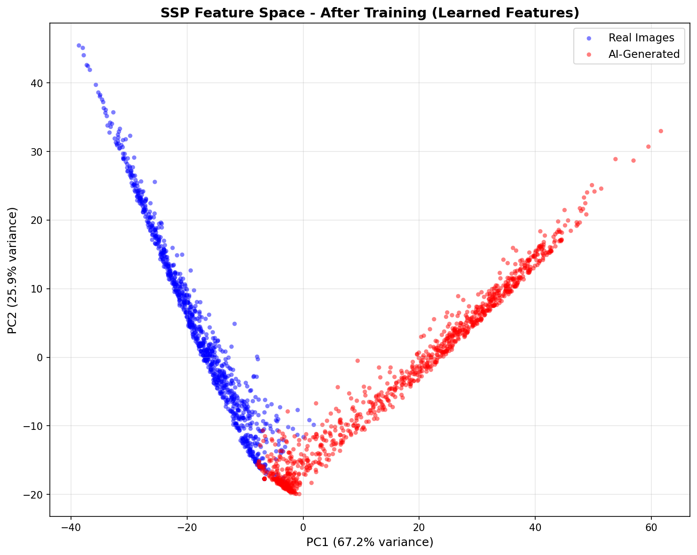</td>
</tr>
<tr>
<td align="center"><b>Before Training: Random Features (PC1: 53%)</b></td>
<td align="center"><b>After Training: Learned Separation (PC1: 67%)</b></td>
</tr>
</table>

**Analysis**: After training, SSP learns to separate real and AI-generated images in feature space with significantly higher explained variance (67% vs 53%), demonstrating effective learning of discriminative noise patterns.

---

## 📊 Comprehensive Model Comparison

### Performance Summary Table

| Model | BigGAN (Seen) | SDv1.5 (Seen) | ADM (Unseen) | Overall | AUC | Winner |
|-------|---------------|---------------|--------------|---------|-----|--------|
| **SimpleCNN** | 98.35% | 50.19% | 55.53% | 67.36% | 0.689 | - |
| **ResNet50** | **99.86%** ⭐ | 51.61% | 52.11% | 67.86% | 0.732 | BigGAN Only |
| **SSP** | 98.92% | **98.42%** ⭐ | **97.15%** ⭐ | **97.76%** ⭐ | **0.997** ⭐ | **Overall** |

### Visual Comparison

```
╔══════════════════════════════════════════════════════════════╗
║              GENERALIZATION PERFORMANCE                      ║
╠══════════════════════════════════════════════════════════════╣
║                      ADM (Unseen Generator)                  ║
║                                                              ║
║  SimpleCNN   ████▌                                 55.53%   ║
║  ResNet50    ████▌                                 52.11%   ║
║  SSP         ████████████████████████████████████▌ 97.15%   ║
║                                                              ║
║              Overall (All 3 Generators)                      ║
║                                                              ║
║  SimpleCNN   ██████████████                        67.36%   ║
║  ResNet50    ██████████████                        67.86%   ║
║  SSP         ██████████████████████████████████▌   97.76%   ║
╚══════════════════════════════════════════════════════════════╝
```

### Precision-Recall Analysis

| Model | Precision (Real) | Recall (Fake) | F1-Score | Balance |
|-------|-----------------|---------------|----------|---------|
| SimpleCNN (ADM) | 66.0% | 55.5% | 46.8% | Poor |
| ResNet50 (ADM) | 73.5% | 52.1% | 38.0% | Poor |
| **SSP (ADM)** | **98.9%** | **95.3%** | **97.1%** | **Excellent** |

---

## 💡 Key Insights & Discussion

### 1. **Training Data Diversity is Critical**
Both SimpleCNN and ResNet50 achieved 98-99% on BigGAN but failed completely on other generators (~50% = random). This demonstrates severe overfitting to training distribution.

### 2. **Transfer Learning Doesn't Help Deepfake Detection**
Despite ImageNet pre-training, ResNet50 performed no better than SimpleCNN on unseen generators. Natural image features don't transfer to deepfake detection.

### 3. **Steganalysis > Semantic Features**
SSP's success proves that:
- AI generators leave statistical **noise patterns** independent of image content
- These patterns are **generator-invariant** (transfer across different models)
- Explicit noise modeling (SRM filters) is superior to learned features

### 4. **Patch-Based Approach Prevents Overfitting**
By focusing on 32×32 patches:
- Model can't memorize semantic patterns
- Forces learning of low-level statistical artifacts
- Generalizes to any generator's noise signature

---

## 🎯 Conclusions

### Main Findings

1. **SSP Demonstrates Superior Generalization** ⭐
   - 97.15% accuracy on completely unseen ADM generator
   - Minimal performance drop between seen and unseen data
   - Proves steganalysis-based approach is the right direction

2. **Baseline Methods Fail to Generalize**
   - SimpleCNN and ResNet50 overfit to BigGAN-specific patterns
   - Transfer learning from ImageNet does not help
   - Semantic features are unreliable for cross-generator detection

3. **Practical Implications**
   - **For Production**: Use SSP for robust real-world deployment
   - **For Research**: Focus on generator-invariant noise features, not semantic content
   - **For Evaluation**: Always test on unseen generators

### Limitations

- **Computational Cost**: Patch extraction is CPU-intensive (slower than standard CNNs)
- **Training Time**: SSP requires 30 epochs vs 10 for baselines
- **Dataset Requirement**: Still needs diverse training data for optimal results

### Future Work

- Test on additional unseen generators (DALL-E, Midjourney, Firefly)
- Investigate adversarialrobustness against post-processing
- Extend to video deepfake detection
- Explore ensemble methods combining multiple approaches

---

## 🔧 Technologies Used

### Deep Learning
- **PyTorch** 2.0+ - Neural network training
- **torchvision** - Pre-trained models and transformations
- **scikit-learn** - Metrics and evaluation

### Visualization
- **Matplotlib** - Plotting
- **seaborn** - Statistical visualizations
- **NumPy** - Numerical operations

### Models
- **SimpleCNN** - Custom architecture
- **ResNet50** - torchvision.models (ImageNet pretrained)
- **SSP** - [Official Implementation](https://github.com/bcmi/SSP-AI-Generated-Image-Detection)

---

## 📝 Citation

```bibtex
@article{chen2024simple,
  title={A Single Simple Patch is All You Need for AI-generated Image Detection},
  author={Chen, Jiaxuan and Yao, Jieteng and Niu, Li},
  journal={arXiv preprint arXiv:2402.01123},
  year={2024}
}
```

---

## 📄 Repository Structure

```
github_submission/
├── README.md                    # This file
├── RESULTS_SUMMARY.txt         # Quick results overview
├── exp1_simplecnn/             # Experiment 1 visualizations
│   ├── cm_*.png               # Confusion matrices
│   ├── roc_*.png              # ROC curves
│   └── pca_*.png              # Feature visualizations
├── exp2_resnet50/             # Experiment 2 visualizations
│   ├── cm_*.png
│   ├── roc_*.png
│   └── pca_*.png
└── exp3_ssp/                  # Experiment 3 visualizations
    ├── cm_*.png
    ├── roc_*.png
    └── report_*.txt
```

---

*Research conducted December 2024*
*Comparative Study on Cross-Generator Deepfake Detection*
